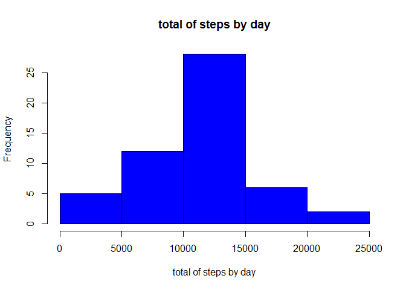
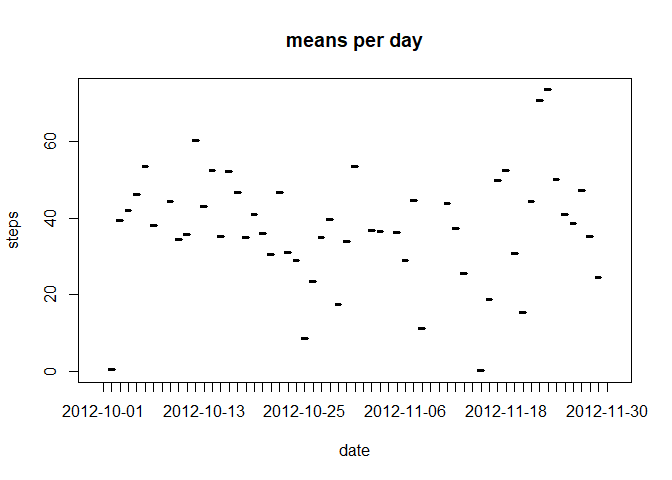
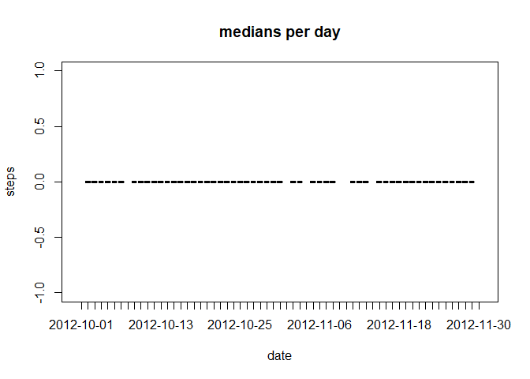
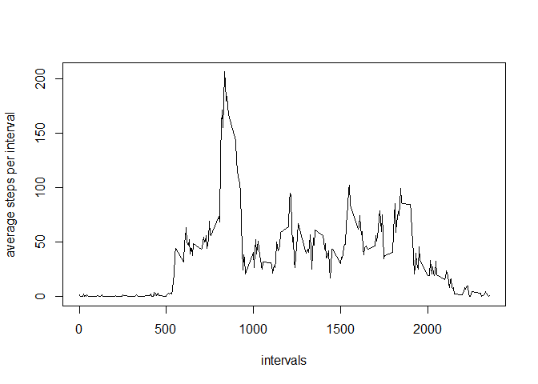
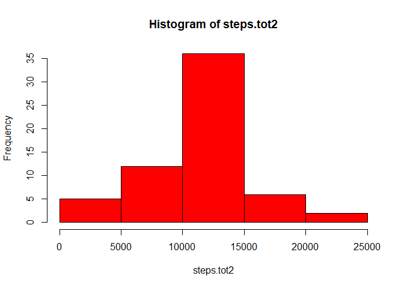
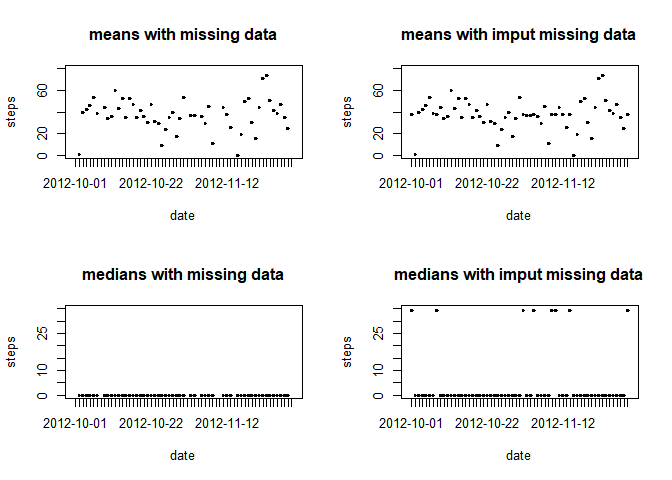
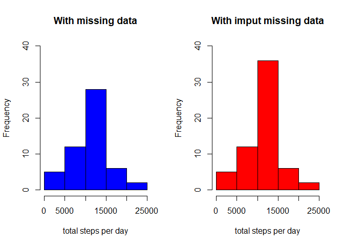
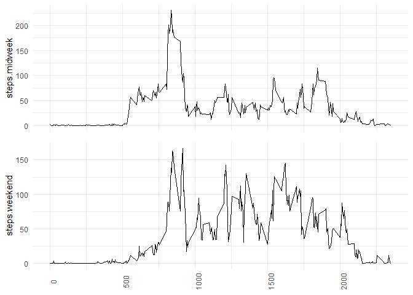

## Loading and preprocessing the data
Show any code that is needed to

1. Load the data (i.e. read.csv())

2. Process/transform the data (if necessary) into a format suitable for your
analysis


```r
library(dplyr)
```

```
## 
## Attaching package: 'dplyr'
```

```
## The following objects are masked from 'package:stats':
## 
##     filter, lag
```

```
## The following objects are masked from 'package:base':
## 
##     intersect, setdiff, setequal, union
```

```r
library(ggplot2)
library(grid)
data<-read.csv('activity/activity.csv')
head(data)
```

```
##   steps       date interval
## 1    NA 2012-10-01        0
## 2    NA 2012-10-01        5
## 3    NA 2012-10-01       10
## 4    NA 2012-10-01       15
## 5    NA 2012-10-01       20
## 6    NA 2012-10-01       25
```


## What is mean total number of steps taken per day?
For this part of the assignment, you can ignore the missing values in the dataset.

1. Make a histogram of the total number of steps taken each day


```r
steps.tot<-tapply(data$steps,data$date,sum)
 #steps.tot

h1<-hist(steps.tot,col='blue',xlab='total of steps by day',main='total of steps by day')
```

<!-- -->

```r
h1
```

```
## $breaks
## [1]     0  5000 10000 15000 20000 25000
## 
## $counts
## [1]  5 12 28  6  2
## 
## $density
## [1] 1.886792e-05 4.528302e-05 1.056604e-04 2.264151e-05 7.547170e-06
## 
## $mids
## [1]  2500  7500 12500 17500 22500
## 
## $xname
## [1] "steps.tot"
## 
## $equidist
## [1] TRUE
## 
## attr(,"class")
## [1] "histogram"
```

2. Calculate and report the mean and median total number of steps taken
per day


```r
steps.mean1<-aggregate(data = data, steps ~ date, FUN = mean)
steps.median1<-aggregate(data = data, steps ~ date, FUN = median)


bad<-is.na(data$steps)
data2<-data[!bad,]
steps.mean<-tapply(data2$steps,data2$date,mean)
steps.median<-tapply(data2$steps,data2$date,median)
```

The means of total number of steps taken
per day are the following

```r
steps.mean1
```

```
##          date      steps
## 1  2012-10-02  0.4375000
## 2  2012-10-03 39.4166667
## 3  2012-10-04 42.0694444
## 4  2012-10-05 46.1597222
## 5  2012-10-06 53.5416667
## 6  2012-10-07 38.2465278
## 7  2012-10-09 44.4826389
## 8  2012-10-10 34.3750000
## 9  2012-10-11 35.7777778
## 10 2012-10-12 60.3541667
## 11 2012-10-13 43.1458333
## 12 2012-10-14 52.4236111
## 13 2012-10-15 35.2048611
## 14 2012-10-16 52.3750000
## 15 2012-10-17 46.7083333
## 16 2012-10-18 34.9166667
## 17 2012-10-19 41.0729167
## 18 2012-10-20 36.0937500
## 19 2012-10-21 30.6284722
## 20 2012-10-22 46.7361111
## 21 2012-10-23 30.9652778
## 22 2012-10-24 29.0104167
## 23 2012-10-25  8.6527778
## 24 2012-10-26 23.5347222
## 25 2012-10-27 35.1354167
## 26 2012-10-28 39.7847222
## 27 2012-10-29 17.4236111
## 28 2012-10-30 34.0937500
## 29 2012-10-31 53.5208333
## 30 2012-11-02 36.8055556
## 31 2012-11-03 36.7048611
## 32 2012-11-05 36.2465278
## 33 2012-11-06 28.9375000
## 34 2012-11-07 44.7326389
## 35 2012-11-08 11.1770833
## 36 2012-11-11 43.7777778
## 37 2012-11-12 37.3784722
## 38 2012-11-13 25.4722222
## 39 2012-11-15  0.1423611
## 40 2012-11-16 18.8923611
## 41 2012-11-17 49.7881944
## 42 2012-11-18 52.4652778
## 43 2012-11-19 30.6979167
## 44 2012-11-20 15.5277778
## 45 2012-11-21 44.3993056
## 46 2012-11-22 70.9270833
## 47 2012-11-23 73.5902778
## 48 2012-11-24 50.2708333
## 49 2012-11-25 41.0902778
## 50 2012-11-26 38.7569444
## 51 2012-11-27 47.3819444
## 52 2012-11-28 35.3576389
## 53 2012-11-29 24.4687500
```

```r
plot(steps.mean1, main='means per day')
```

<!-- -->


The median of total number of steps taken
per day are the following


```r
steps.median1
```

```
##          date steps
## 1  2012-10-02     0
## 2  2012-10-03     0
## 3  2012-10-04     0
## 4  2012-10-05     0
## 5  2012-10-06     0
## 6  2012-10-07     0
## 7  2012-10-09     0
## 8  2012-10-10     0
## 9  2012-10-11     0
## 10 2012-10-12     0
## 11 2012-10-13     0
## 12 2012-10-14     0
## 13 2012-10-15     0
## 14 2012-10-16     0
## 15 2012-10-17     0
## 16 2012-10-18     0
## 17 2012-10-19     0
## 18 2012-10-20     0
## 19 2012-10-21     0
## 20 2012-10-22     0
## 21 2012-10-23     0
## 22 2012-10-24     0
## 23 2012-10-25     0
## 24 2012-10-26     0
## 25 2012-10-27     0
## 26 2012-10-28     0
## 27 2012-10-29     0
## 28 2012-10-30     0
## 29 2012-10-31     0
## 30 2012-11-02     0
## 31 2012-11-03     0
## 32 2012-11-05     0
## 33 2012-11-06     0
## 34 2012-11-07     0
## 35 2012-11-08     0
## 36 2012-11-11     0
## 37 2012-11-12     0
## 38 2012-11-13     0
## 39 2012-11-15     0
## 40 2012-11-16     0
## 41 2012-11-17     0
## 42 2012-11-18     0
## 43 2012-11-19     0
## 44 2012-11-20     0
## 45 2012-11-21     0
## 46 2012-11-22     0
## 47 2012-11-23     0
## 48 2012-11-24     0
## 49 2012-11-25     0
## 50 2012-11-26     0
## 51 2012-11-27     0
## 52 2012-11-28     0
## 53 2012-11-29     0
```

```r
plot(steps.median1, main='medians per day')
```

<!-- -->


## What is the average daily activity pattern?

1. Make a time series plot (i.e. type = "l") of the 5-minute interval (x-axis)
and the average number of steps taken, averaged across all days (y-axis)


```r
steps.mean.int<-tapply(data2$steps,data2$interval,mean)
 

len1<-length(steps.mean.int)

intervals<-data2$interval[1:len1]
plot(steps.mean.int~intervals,type='l',ylab='average steps per interval')
```

<!-- -->


2. Which 5-minute interval, on average across all the days in the dataset,
contains the maximum number of steps?

```r
df<-data.frame(steps.mean.int,intervals)

mx<-max(df$steps.mean.int)

mx.int<-df$intervals[steps.mean.int==mx]
#The interval with maximum steps is the interval
mx.int
```

```
## [1] 835
```

```r
# with a value of steps
mx
```

```
## [1] 206.1698
```
The interval with maximum steps is the interval 835
with a value of steps 206.1698113


## Imputing missing values
1. Calculate and report the total number of missing values in the dataset
(i.e. the total number of rows with NAs)


```r
# total number of rows with  NAs
s<-sum(!complete.cases(data))
s
```

```
## [1] 2304
```

The total number of missing values in the dataset is 2304


2. Devise a strategy for filling in all of the missing values in the dataset. The
strategy does not need to be sophisticated. For example, you could use
the mean/median for that day, or the mean for that 5-minute interval, etc.


 We will use the mean of the day or interval to fill the missing values.


3. Create a new dataset that is equal to the original dataset but with the
missing data filled in.

 We create a new dataset that is equal to the original dataset but with the
missing data filled in.

```r
#we will use the mean of the day or interval to fill the missing values.

#

len<-length(data$interval)


dfa <- aggregate(data = data, steps ~ interval, FUN = mean)
 

df3 <- merge(x = data, y = dfa, by = "interval", suffixes = c("",".int.mean"))


len<-length(df3$steps)


for (i in 1:len){
  
  if(is.na(df3[i,2])){
  
       
     
        df3[i,2]<-df3[i,4]
        
           
    
          }
   
    }


head(df3,30)
```

```
##    interval     steps       date steps.int.mean
## 1         0  1.716981 2012-10-01       1.716981
## 2         0  0.000000 2012-11-23       1.716981
## 3         0  0.000000 2012-10-28       1.716981
## 4         0  0.000000 2012-11-06       1.716981
## 5         0  0.000000 2012-11-24       1.716981
## 6         0  0.000000 2012-11-15       1.716981
## 7         0  0.000000 2012-10-20       1.716981
## 8         0  0.000000 2012-11-16       1.716981
## 9         0  0.000000 2012-11-07       1.716981
## 10        0  0.000000 2012-11-25       1.716981
## 11        0  1.716981 2012-11-04       1.716981
## 12        0  0.000000 2012-11-08       1.716981
## 13        0  0.000000 2012-10-12       1.716981
## 14        0  0.000000 2012-10-30       1.716981
## 15        0  0.000000 2012-11-26       1.716981
## 16        0 47.000000 2012-10-04       1.716981
## 17        0  0.000000 2012-11-27       1.716981
## 18        0  0.000000 2012-10-31       1.716981
## 19        0  0.000000 2012-11-18       1.716981
## 20        0  0.000000 2012-10-05       1.716981
## 21        0  0.000000 2012-10-14       1.716981
## 22        0  0.000000 2012-10-23       1.716981
## 23        0  0.000000 2012-11-19       1.716981
## 24        0  0.000000 2012-10-11       1.716981
## 25        0  0.000000 2012-10-15       1.716981
## 26        0  0.000000 2012-10-06       1.716981
## 27        0  0.000000 2012-11-11       1.716981
## 28        0  0.000000 2012-11-29       1.716981
## 29        0  0.000000 2012-11-02       1.716981
## 30        0  0.000000 2012-10-07       1.716981
```

4. Make a histogram of the total number of steps taken each day and Calculate
and report the mean and median total number of steps taken per day. Do
these values differ from the estimates from the first part of the assignment?
What is the impact of imputing missing data on the estimates of the total
daily number of steps?


We make a histogram of the total number of steps taken each day.


```r
steps.tot2<-tapply(df3$steps,df3$date,sum)
 #steps.tot2

h2<-hist(steps.tot2,col='red')
```

<!-- -->

```r
h2
```

```
## $breaks
## [1]     0  5000 10000 15000 20000 25000
## 
## $counts
## [1]  5 12 36  6  2
## 
## $density
## [1] 1.639344e-05 3.934426e-05 1.180328e-04 1.967213e-05 6.557377e-06
## 
## $mids
## [1]  2500  7500 12500 17500 22500
## 
## $xname
## [1] "steps.tot2"
## 
## $equidist
## [1] TRUE
## 
## attr(,"class")
## [1] "histogram"
```

We calculate the mean and median total number of steps taken per day.


```r
steps.mean2<-aggregate(data = df3, steps ~ date, FUN = mean)
steps.median2<-aggregate(data = df3, steps ~ date, FUN = median)
```
the means are 


```r
steps.mean2
```

```
##          date      steps
## 1  2012-10-01 37.3825996
## 2  2012-10-02  0.4375000
## 3  2012-10-03 39.4166667
## 4  2012-10-04 42.0694444
## 5  2012-10-05 46.1597222
## 6  2012-10-06 53.5416667
## 7  2012-10-07 38.2465278
## 8  2012-10-08 37.3825996
## 9  2012-10-09 44.4826389
## 10 2012-10-10 34.3750000
## 11 2012-10-11 35.7777778
## 12 2012-10-12 60.3541667
## 13 2012-10-13 43.1458333
## 14 2012-10-14 52.4236111
## 15 2012-10-15 35.2048611
## 16 2012-10-16 52.3750000
## 17 2012-10-17 46.7083333
## 18 2012-10-18 34.9166667
## 19 2012-10-19 41.0729167
## 20 2012-10-20 36.0937500
## 21 2012-10-21 30.6284722
## 22 2012-10-22 46.7361111
## 23 2012-10-23 30.9652778
## 24 2012-10-24 29.0104167
## 25 2012-10-25  8.6527778
## 26 2012-10-26 23.5347222
## 27 2012-10-27 35.1354167
## 28 2012-10-28 39.7847222
## 29 2012-10-29 17.4236111
## 30 2012-10-30 34.0937500
## 31 2012-10-31 53.5208333
## 32 2012-11-01 37.3825996
## 33 2012-11-02 36.8055556
## 34 2012-11-03 36.7048611
## 35 2012-11-04 37.3825996
## 36 2012-11-05 36.2465278
## 37 2012-11-06 28.9375000
## 38 2012-11-07 44.7326389
## 39 2012-11-08 11.1770833
## 40 2012-11-09 37.3825996
## 41 2012-11-10 37.3825996
## 42 2012-11-11 43.7777778
## 43 2012-11-12 37.3784722
## 44 2012-11-13 25.4722222
## 45 2012-11-14 37.3825996
## 46 2012-11-15  0.1423611
## 47 2012-11-16 18.8923611
## 48 2012-11-17 49.7881944
## 49 2012-11-18 52.4652778
## 50 2012-11-19 30.6979167
## 51 2012-11-20 15.5277778
## 52 2012-11-21 44.3993056
## 53 2012-11-22 70.9270833
## 54 2012-11-23 73.5902778
## 55 2012-11-24 50.2708333
## 56 2012-11-25 41.0902778
## 57 2012-11-26 38.7569444
## 58 2012-11-27 47.3819444
## 59 2012-11-28 35.3576389
## 60 2012-11-29 24.4687500
## 61 2012-11-30 37.3825996
```

the medians are 

```r
steps.median2
```

```
##          date    steps
## 1  2012-10-01 34.11321
## 2  2012-10-02  0.00000
## 3  2012-10-03  0.00000
## 4  2012-10-04  0.00000
## 5  2012-10-05  0.00000
## 6  2012-10-06  0.00000
## 7  2012-10-07  0.00000
## 8  2012-10-08 34.11321
## 9  2012-10-09  0.00000
## 10 2012-10-10  0.00000
## 11 2012-10-11  0.00000
## 12 2012-10-12  0.00000
## 13 2012-10-13  0.00000
## 14 2012-10-14  0.00000
## 15 2012-10-15  0.00000
## 16 2012-10-16  0.00000
## 17 2012-10-17  0.00000
## 18 2012-10-18  0.00000
## 19 2012-10-19  0.00000
## 20 2012-10-20  0.00000
## 21 2012-10-21  0.00000
## 22 2012-10-22  0.00000
## 23 2012-10-23  0.00000
## 24 2012-10-24  0.00000
## 25 2012-10-25  0.00000
## 26 2012-10-26  0.00000
## 27 2012-10-27  0.00000
## 28 2012-10-28  0.00000
## 29 2012-10-29  0.00000
## 30 2012-10-30  0.00000
## 31 2012-10-31  0.00000
## 32 2012-11-01 34.11321
## 33 2012-11-02  0.00000
## 34 2012-11-03  0.00000
## 35 2012-11-04 34.11321
## 36 2012-11-05  0.00000
## 37 2012-11-06  0.00000
## 38 2012-11-07  0.00000
## 39 2012-11-08  0.00000
## 40 2012-11-09 34.11321
## 41 2012-11-10 34.11321
## 42 2012-11-11  0.00000
## 43 2012-11-12  0.00000
## 44 2012-11-13  0.00000
## 45 2012-11-14 34.11321
## 46 2012-11-15  0.00000
## 47 2012-11-16  0.00000
## 48 2012-11-17  0.00000
## 49 2012-11-18  0.00000
## 50 2012-11-19  0.00000
## 51 2012-11-20  0.00000
## 52 2012-11-21  0.00000
## 53 2012-11-22  0.00000
## 54 2012-11-23  0.00000
## 55 2012-11-24  0.00000
## 56 2012-11-25  0.00000
## 57 2012-11-26  0.00000
## 58 2012-11-27  0.00000
## 59 2012-11-28  0.00000
## 60 2012-11-29  0.00000
## 61 2012-11-30 34.11321
```

 Do these values differ from the estimates from the first part of the assignment?
 
 Yes they differ. We plotted them against each other and we see that the means without missing values are more dispersed. While the medians, with imput data reach some values greater than 30.

```r
par(mfrow=c(2,2))
plot(steps.mean1 , main='means with missing data',ylim=c(0,80))
plot(steps.mean2,  main='means with imput missing data',ylim=c(0,80))
plot(steps.median1,  main='medians with missing data',ylim=c(0,35))
plot(steps.median2,  main='medians with imput missing data',ylim=c(0,35))
```

<!-- -->
 

What is the impact of imputing missing data on the estimates of the total
daily number of steps?


We see a clear difference by comparing both histograms. With imput missing data we have more frequency of total steps. 


```r
par(mfrow=c(1,2))
plot(h1,col='blue',main='With missing data',xlab='total steps per day',ylim=c(0,40))
plot(h2,col='red',main='With imput missing data',xlab='total steps per day',ylim=c(0,40))
```

<!-- -->
 

## Are there differences in activity patterns between weekdays and weekends?

1. Create a new factor variable in the dataset with two levels – “weekday”
and “weekend” indicating whether a given date is a weekday or weekend
day.

We create a new dataset with the required indicator

```r
df3$date <- as.Date(df3$date)
 
weekd <- c('Monday', 'Tuesday', 'Wednesday', 'Thursday', 'Friday')

  df3$Week.Day <- c('weekend', 'weekday')[(weekdays(df3$date) %in% weekd)+1L]       
        head(df3)
```

```
##   interval    steps       date steps.int.mean Week.Day
## 1        0 1.716981 2012-10-01       1.716981  weekday
## 2        0 0.000000 2012-11-23       1.716981  weekday
## 3        0 0.000000 2012-10-28       1.716981  weekend
## 4        0 0.000000 2012-11-06       1.716981  weekday
## 5        0 0.000000 2012-11-24       1.716981  weekend
## 6        0 0.000000 2012-11-15       1.716981  weekday
```
2. Make a panel plot containing a time series plot (i.e. type = "l") of the
5-minute interval (x-axis) and the average number of steps taken, averaged
across all weekday days or weekend days (y-axis). The plot should look
something like the following, which was creating using simulated data:

We show the panel plot.


```r
dfwknd<-  df3[df3$Week.Day=='weekend',]
         dfmidwk<-df3[df3$Week.Day=='weekday',]
         
         
         
        dfwknd.mean <- aggregate( data=dfwknd , steps ~ interval, FUN = mean)
          dfmidwk.mean <- aggregate(data=dfmidwk , steps ~ interval, FUN = mean)
        #  head(dfwknd.mean)
    df.both<-      merge(dfwknd.mean,dfmidwk.mean,by='interval',suffixes = c(".weekend",".midweek"))
     #  head(df.both)
       
 
       
       p1 <- ggplot( df.both, aes(interval, steps.midweek)) + geom_line() + theme_minimal()+ theme(axis.title.x = element_blank(), axis.text.x = element_blank())

       p2 <- ggplot( df.both,aes(interval,steps.weekend)) + geom_line() + theme_minimal() + theme(axis.title.x = element_blank(),axis.text.x = element_text(angle=90))
       

grid.newpage()
grid.draw(rbind(ggplotGrob(p1), ggplotGrob(p2), size = "last"))
```

<!-- -->

We observe a difference between weekends and midweek days. Althugh the maxima are around the same intervals, overall, means of intervals above 1000 are greater on the weekends.

```
## logical(0)
```

